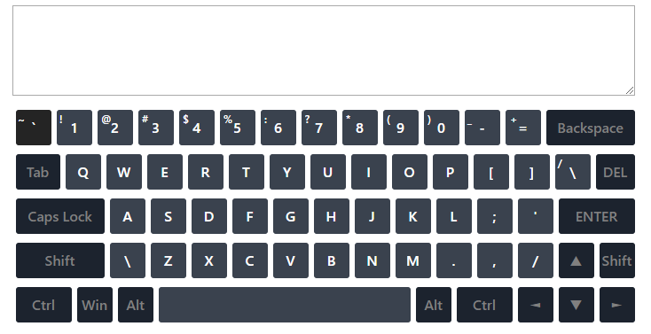
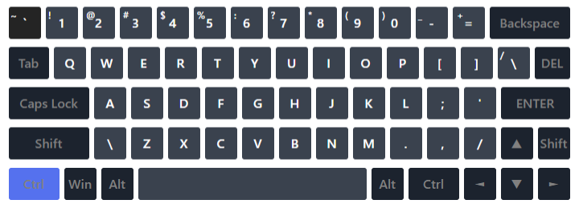
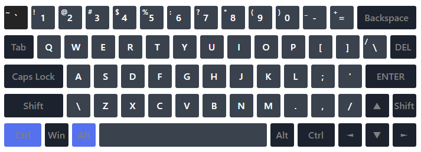

# RSS Virtual Keyboard

#### You are to create a virtual keyboard like this:


### Functional requirements:
- design is up to you
- index.html file must be empty (all the necessary elements should be generated with the usage of JS)
- typing on a physical keyboard should highlight a pressed key on the virtual keyboard:
  
  **There may be differences in keystrokes on different operating systems (Windows, macOS). To avoid mistakes, it's necessary to indicate on the Virtual Keyboard page in which OS the virtual keyboard was created**
- If several buttons are pressed, then all the pressed buttons should be highlighted on the virtual keyboard (there're no exceptions for Ctrl, Alt and Shift as well)
  
- the keyboard should be able to switch between two language layouts (English + any other language). Assigning a keyboard shortcut for switching keyboard layout is up to you. The buttons should display the symbols of the selected language:
- the chosen language should be saved after the page is reloaded. The keys for changing the language should be indicated on the page so that it should be clear for the user how to switch keyboard layout
- keystrokes are animated
- clicks on the buttons with the mouse on the virtual keyboard and pressing the keys on the physical keyboard should input symbols to the text area located on the page above the virtual keyboard.
    - pressing the up, down, left or right arrow keys inputs an arrow symbol in the input field, or implements navigation by the text area.
    - pressing the `enter` should break the line
    - the `tab` key creates a horizontal indent
    - pressing the rest of the functional keys on the keyboard does not result in inputting symbols
    - the `backspace` key removes character before the cursor
    - the `del` key removes character after the cursor
    - the `shift`, `alt`, `ctrl`, `caps lock` and `space` keys should work as on a real keyboard

### Technical requirements
- should work on the latest Chrome version
- usage of JQuery and other JS libraries is prohibited
- usage of Bootstrap and other UI libraries is not allowed
- usage of Angular/React/Vue and other frameworks is not allowed
- usage of CSS preprocessors is allowed
- you must use [eslint (eslint-config-airbnb-base)](https://eslint.org/)
- the working application should be hosted on GitHub Pages (https://pages.github.com/). It happens automatically on 'gh-pages' branch creation. Afterward, the page will be available at the address like https://your-github-account.github.io/name-repository

### Requirements for commits, pull request, repository
- commit messages should follow the [guideline](https://www.conventionalcommits.org/en)
- the pull request name should contain **the task name**
- the pull request description should contain the following information:
    - link to the task
    - screenshot of your application (one should be enough)
    - link to your application
    - date of completion/deadline date
    - your self-check with a preliminary evaluation

Example:

```
1. Task:
   https://github.com/rolling-scopes-school/tasks/blob/master/tasks/rslang/english-for-kids.md
2. App screenshot:
   https://i.imgur.com/9N60IHl.png
3. Deploy:  
   https://rolling-scopes-school.github.io/hallovarvara-RS2020Q1/english-for-kids/dist/
4. Done 19.04.20 (deadline 19.04.20)
5. Score: 200 / 200
- [x] UI, markup, design of main page (+10) and category page (+10)
    - [x] both mobile and desktop versions have all described elements
    - [x] fulfilled all task requirements to app design
- [x] UI, markup, design of menu (+10)
    - [x] both mobile and desktop versions have all described elements
    - [x] fulfilled all task requirements to app design
    - [x] menu links work
    - [x] current page link differ from others
    - [x] all pages have sliding menu
    - [x] menu closes with smooth animation by clicking on crest or any other app element including menu link
- [x] Training mode (+20)
    - [x] english words sound while clicking on card
    - [x] all cards has button for flipping. there's word translation at the back side. card flip back after mouse cursor goes out from card area.
- [x] Code quality (+30)
    - [x] code dublicating minimized (+10)
    - [x] modular JS (+10)
    - [x] webpack, eslint, eslint-config-airbnb-base, babel connected and are used (+10)
- [x] Game mode (+80):
    - [x] click on mode switcher Train/Play turns on game mode. Here're no flipping button and text on card. Card image takes up all card area (if it's ok with app design). „Start game” button appears. (+10)
    - [x] clicking on „Start game” button activate english word pronouncing. Word should be one of presented on page and it should be chosen randomly. For each page and every new game words should generating randomly from scratch (+10)
    - [x] a click on „Start game” button change text on it with „Repeat” icon and view of button. Clicking on „Repeat” button repeats current word pronouncing (+10)
    - [x] if user've clicked on wrong card, „error” sound sounds (+10)
    - [x] if user've clicked on correct card, „correct” sound sounds and new random english word from this page is pronouncing. One word can't participate twice in one game. (+10)
    - [x] card with guessed word become inactive and changes view. Clicking on inactive card doesn't call sound effects and doesn't affect on game score. (+10)
    - [x] when game's started, every click on active card is right or wrong answer. They're shown up like stars or other symbols of different colors on rating panel. Rating panel shows up in game mode. If rating panel fulls of stars, first stars hide, new continues to show. (+10)
    - [x] when all words've guessed: (+10)
        - if all of them are rightly guessed, „success” sound sounds, cards hide, happy smile shows (or another appropriate image),
        - else „failure” sound sounds, cards hide, sad smile shows (or another appropriate image) and mistakes quantity,
        - app automatically redirects to main page with categories' list.
- [x] Statistics page (+40):
    - [x] here're all categories, all words of each category, every word's translation. Page must be shown correctly minimum on 320 px. (+10)
    - [x] close to each word are shown and saved in statistics after page reload: (+10)
        - number of clicks on it's card in training mode,
        - times word was guessed,
        - number of mistaken word in game mode,
        - mistakes density of word.
    - [x] feature to sort data. Strings sort alphabetically, number by number. Sort can be ascending and descending and must cover all data. (+10)
    - [x] here're buttons „Repeat difficult words” и „Reset”: (+10)
        - „Reset” resets statistics,
        - „Repeat difficult words” open category-like page with words with the highest mistakes density. There can be 0–8 words according in how many words user guessed wrong in game mode. After clicking on „Reset” button, on „Repeat difficult words” page should be no words.
- [x] Penalties (0):
    - [x] In app less than 8 categories and less than 8 words in each category (-10)
    - [x] Errors while app's working. (-10 for each, but no more than the total number of points for requirement implementation)
    - [x] Not comply with the requirements for Pull Request, repository, commits names (-10) scores by mentor
```

- Pull request `should not contain commented code, redundant files, changes from other branches and generated files`, for instance, `.bundle.js`. Please, check your changes before creating a pull request. `.editorconfig`, `.gitignore`, etc. could be included in your pull request
- Comments on a PR is a good practice
- [How to write the perfect pull request](https://github.com/blog/1943-how-to-write-the-perfect-pull-request)

## Evaluation criteria:
**Maximum score for the task: 110**

`Minimal scope:`
- [ ] the generation of DOM elements is implemented. `body` in the `index.html` is empty (can contain only `script` tag): `+20`
- [ ] pressing a key on the physical keyboard highlights a key on the virtual keyboard (you should check keystrokes of numbers, letters, punctuation marks, `backspace`, `del` (if it's present), `enter`, `shift`, `alt`, `ctrl`, `tab`, `caps lock`, `space`, arrow keys: `+10`

`Basic scope:`
- switching keyboard layouts between English and another language is implemented. Selected language should be saved and used on page reload. A key combination for switching the language should be indicated on the page with the virtual keyboard: `+15`
- [ ] mouse clicks on the buttons on the virtual keyboard or pressing the buttons on the physical keyboard inputs characters to the input field (text area): `+15`

`Extra scope:`
- [ ] animation of pressing a key is implemented: `+15`

`Technical requirements:`
- [ ] usage of ES6+ features (classes, property destructuring, etc): `+15`
- [ ] usage of eslint: `+10`
- [ ] requirements to the repository, commits and pull request are met: `+10`

`Penalties:`
- [ ] there're errors related to the executable code (errors like `favicon.ico: Failed to load resource: the server responded with a status of 404` are not taken into account) or there're eslint-config-airbnb-base warnings: `-15`

## Useful links:

- [Demo](https://wonderful-swartz-d8b98d.netlify.com/)
- [DOM](http://learn.javascript.info/document)
- [Event](http://learn.javascript.info/event-details)
- [An Introduction To DOM Events](https://www.smashingmagazine.com/2013/11/an-introduction-to-dom-events/)
- [Keycode](https://keycode.info) (Please note that `event.keyCode` is deprecated)
- [Keyboard events](https://learn.javascript.info/keyboard-events)
- [Eslint (eslint-config-airbnb-base)](https://eslint.org/)
