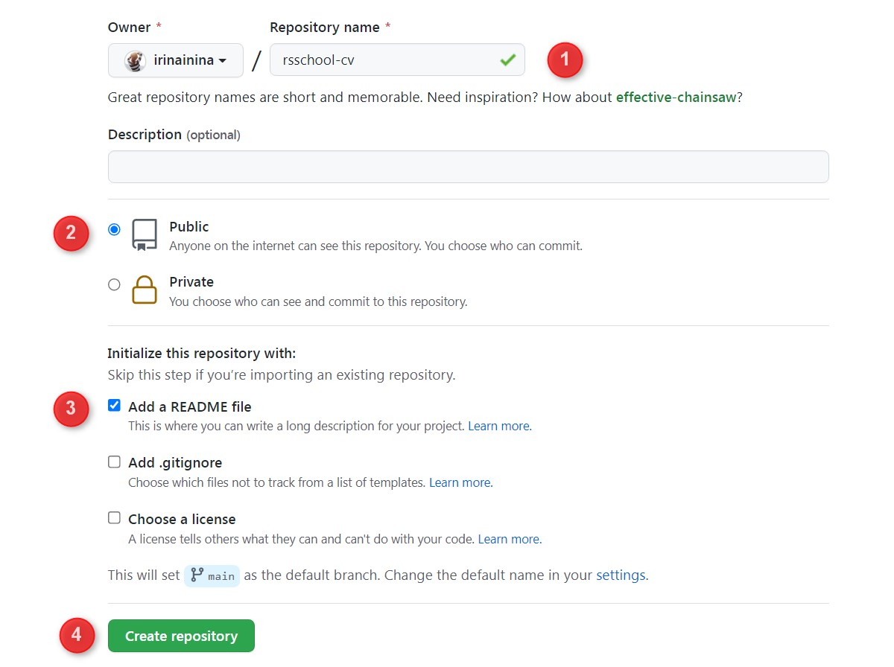
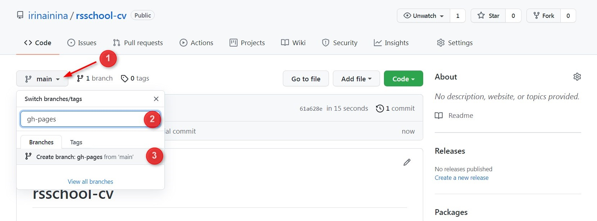
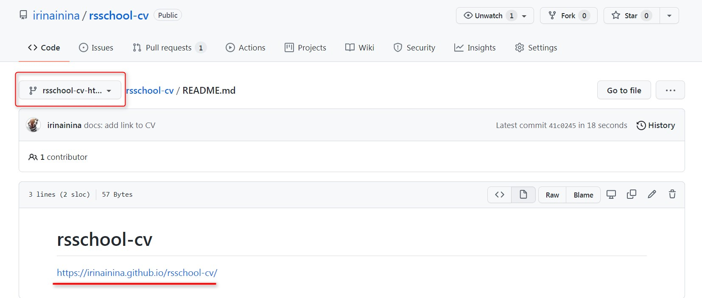
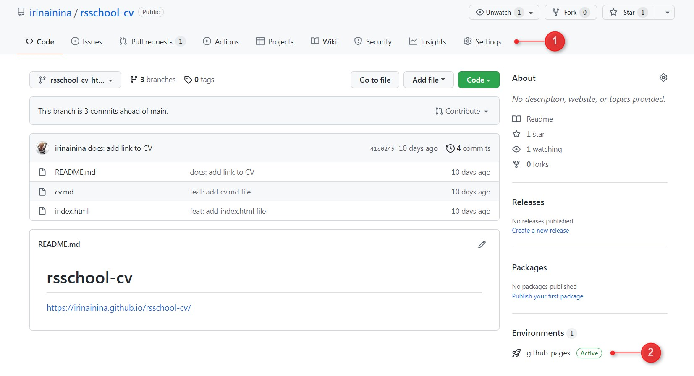
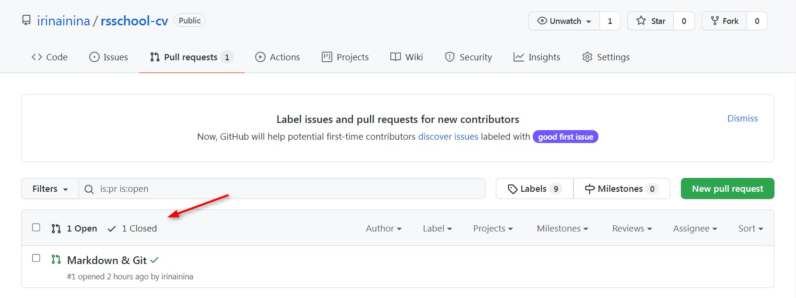

## Советы по выполнению задания СV - простая версия

Если [предыдущие советы](cv-hints.md) показались немного сложными для начинающих, первую и вторую части таска CV можно выполнить более простым способом, при помощи интерфейса GitHub

Преимущество этого способа в том, что нет необходимости устанавливать никакие программы.  
Кроме того, этот способ работает всегда и выручает в тех случаях, когда с Git возникают проблемы.  

## Задание Markdown & Git
Ещё раз читаем требования задания [Markdown & Git](git-markdown.md) и выполняем их по пунктам

#### 1. Создаём репозиторий

Заходим на свой GitHub, кликаем на стрелку слева от аватарки, выбираем пункт `New repository`

<kbd></kbd>

#### 2. Настройки репозитория
- Указываем название репозитория `rsschool-cv`  
- Оставляем выбранным пункт `Public` - это настройка по умолчанию  
- Ставим галочку в пункте `Add a README file`
- Нажимаем на кнопку `Create repository`

<kbd></kbd>

#### 3. Создаём ветку `gh-pages`
- Кликаем на стрелку рядом с названием ветки `main`
- Указываем название ветки, которую хотим создать `gh-pages`
- Кликаем по надписи `Create branch: gh-pages from main`  

Мы создали ветку `gh-pages` и перешли в неё. В эту же ветку переместился файл `README.md` ветки `main`

<kbd></kbd>

#### 4. Добавление файла `cv.md`

В ветку `gh-pages` нужно добавить файл `cv.md`  
Сделать это можно одним из двух способов: 
1) создать файл в самом репозитории средствами GitHub 
2) создать файл на компьютере и загрузить на GitHub

Мне больше нравится второй вариант, так как таким способом можно загрузить на GitHub не только файл, но и целую папку. 

Посмотрим как работают оба варианта.

В репозитории нажимаем стрелку возле кнопки `Add file` и выбираем один из двух вариантов `Create new file` или `Upload files`

<kbd></kbd>

Если выбрали `Create new file`, нужно будет указать название и расширение создаваемого файла `cv.md` и добавить его содержание. Клик на вкладку `Preview` позволит увидеть как выглядит создаваемый файл.

<kbd></kbd>

Перед тем, как нажать зелёную кнопку внизу `Commit new file` необходимо указать название коммита. Например, `feat: add cv.md file`

<kbd></kbd>

Если решили нажать на `Upload files` у вас снова появляются две возможности:
- выбрать файл поиском на компьютере
- перетянуть файл или папку с файлами с компьютера в окно для добавления файлов.

Будьте внимательны. Перед тем, как нажать зелёную кнопку внизу `Commit changes` необходимо указать название коммита. Например, `feat: add cv.md file`

#### 5. Названия коммитов

По условиям задания в ветке `gh-pages` должно быть не меньше трёх коммитов, названия которых начинаются с одного из префиксов `init:`, `feat: `, `fix: `, `refactor: `, `docs:`.

В результате выполнения предыдущего пункта сделан один коммит. Нужно сделать ещё два коммита. Для этого можно нажать на карандашик возле файла `cv.md` и внести в него какие-то изменения. 

<kbd></kbd>

Этот коммит можно назвать `feat: update cv.md file`.  

<kbd></kbd>

Аналогично создайте ещё один коммит.

Автотест не умеет читать имена коммитов, тем более, проверять логичность их наименований. Всё, что он проверяет - наличие префикса. И добавление коммитов с неправильными названиями - самая частая ошибка при выполнении этого задания. Если вы её допустили, таск нужно будет переделать с самого начала. Т.е удалить репозиторий `rsschool-cv`, создать новый с таким же названием, и сделать задание ещё раз.

Дело в том, что у GitHub нет удобного механизма переименования коммитов, а тот, что есть, намного сложнее повторного выполнения задания.

#### 6. Ссылка на CV в README.md

Описание проекта в файле README.md - часть культуры разработки, о которой упоминалось выше. Это описание должно быть достаточным для понимания что это за проект, для чего он предназначен, как его запустить. В данном задании требуется самый минимум - добавить в README.md ветки `gh-pages` ссылку на созданное вами CV, задеплоенное на хостинге GitHub Pages.  

Деплой - это размещение сайта или приложения в интернете. GitHub предлагает простой и удобный механизм деплоя - достаточно просто разместить файлы проекта в ветке `gh-pages` и, если в корне проекта находится файл в формате `.html` или `.md`, этот проект будет размещён в интернете.

Ссылка на созданное вами CV в формате markdown имеет вид `https://GITHUB-USERNAME.github.io/rsschool-cv/cv`, где вместо `GITHUB-USERNAME` нужно указать свой никнейм на сайте GitHub. В моём случае это будет ссылка `https://irinainina.github.io/rsschool-cv/cv`

Кликните по названию `rsschool-cv` вверху страницы, так вы перейдёте на главную страницу репозитория.  
Выберите ветку `gh-pages`, кликните по её названию, так перейдёте в ветку `gh-pages` репозитория.

<kbd></kbd>

Убедитесь, что находитесь в ветке `gh-pages`, нажмите на карандашик в правом верхнем углу файла README.md, добавьте в него ссылку на CV.

<kbd></kbd>

Будьте внимательны. Перед тем как нажать кнопку `Commit change`, дайте название коммиту, например `docs: add link to project`.

#### 7. Создадим Pull Request 

Необходимо создать Pull Request с названием `Markdown & Git` из ветки `gh-pages` в ветку `main`.  
Для этого нажмите на вкладку `Pull Request` вверху

<kbd></kbd>

Затем нажмите на зелёную кнопку `New pull request` справа.  
И укажите с какой ветки `gh-pages` в какую `main` делаете Pull Request.  
После этого станет доступна кнопка `Create pull request`. Нажмите на неё

<kbd></kbd>

Дайте Pull Request название `Markdown & Git`, добавьте описание и ещё раз нажмите на кнопку `Create pull request` внизу.

<kbd></kbd>

Нажимать на кнопку `Merge pull request` не нужно.

#### 8. Описание Pull Request

На этапе stage#0 - stage#1 описания Pull Request не проверяются.  
Требования описывать Pull Request, как и вести историю коммитов, добавлены для того, чтобы вы с самого начала привыкали к общей культуре разработки.  

В требованиях к описанию Pull Request сказано, что в Pull Request нужно добавить скриншот своей работы. Добавить скриншот можно просто перетянув его в окно с описанием PR.

Оценку своей работы дайте по пунктам требований, отмечая все выполненные и невыполненные пункты.  

#### 9. Отправка работы на проверку

Пройдите по ссылке https://app.rs.school/  
Выберите вкладку `Auto-Test`  
Выберите задание `CV#1. Markdown & Git`  
Нажмите синюю кнопку `Submit` внизу.  
С названием этой кнопки связано выражение "засабмитить задание" т.е отправить его на проверку.  
Чтобы увидеть результат проверки, может понадобиться перезагрузить страницу.

<kbd></kbd>

Поздравляю! Вы выполнили первую часть задания.

## Задание HTML, CSS & Git Basics
Описание задания [HTML, CSS & Git Basics](html-css-git.md)

#### 1. Создаём ветку `rsschool-cv-html`

- Убедитесь, что находитесь в ветке `gh-pages`
- Кликаем на стрелку рядом
- Указываем название ветки, которую хотим создать `rsschool-cv-html`
- Кликаем по надписи `Create branch: rsschool-cv-html from gh-pages`  

Мы создали ветку `rsschool-cv-html` и перешли в неё. В эту же ветку переместились все файлы из ветки `gh-pages`

<kbd></kbd>

#### 2. Добавляем файлы `index.html` и `style.css` в ветку `rsschool-cv-html`

С двумя способами добавления файлов в проект мы уже познакомились раньше.  
В них есть небольшое отличие. GitHub позволяет создать пустой файл, но не позволит пустой файл  загрузить. Именно с этим ограничением связана рекомендация добавить в файлы `index.html` и `style.css` любое содержание, чтобы можно было их загрузить на GitHub  

Будьте внимательны, при добавлении файлов не забывайте указывать названия коммитов используя при этом префиксы.  

#### 3. Ссылка на CV в README.md

Добавляем в файл README.md ветки `rsschool-cv-html` ссылку `https://GITHUB-USERNAME.github.io/rsschool-cv/` в которой вместо `GITHUB-USERNAME` указываем свой никнейм на сайте GitHub.

<kbd></kbd>

Эту ссылку не обязательно составлять вручную, её также можно найти в настройках или на странице репозитория

<kbd></kbd>

#### 4. Создаём Pull Request 

У нас уже есть кнопка `Compare & pull request`, предлагающая создать Pull Request. Кликаем по ней

<kbd></kbd>

По умолчанию GitHub предлагает создать Pull Request в главную ветку репозитория.  
Указываем, что Pull Request создаём из ветки `rsschool-cv-html` в ветку `gh-pages`

<kbd></kbd>

Даём название Pull Request `HTML, CSS & Git Basics`, добавляем описание, нажимаем на кнопку `Create pull request`

<kbd></kbd>

#### 5. Merge Pull Request

Чтобы замержить Pull Request, необходимо нажать на кнопку `Merge pull request`, а затем `Confirm merge`

<kbd></kbd>

При этом все файлы из ветки `rsschool-cv-html` копируются в ветку `gh-pages`

Сам Pull Request при этом закрывается, но не исчезает. Увидеть его можно на вкладке `Closed`

<kbd></kbd>

#### 6. Отправляем работу на проверку

Пройдите по ссылке https://app.rs.school/  
Выберите вкладку `Auto-Test`  
Выберите задание `CV#2. HTML, CSS & Git Basics`  
Нажмите синюю кнопку `Submit` внизу.  

<kbd></kbd>