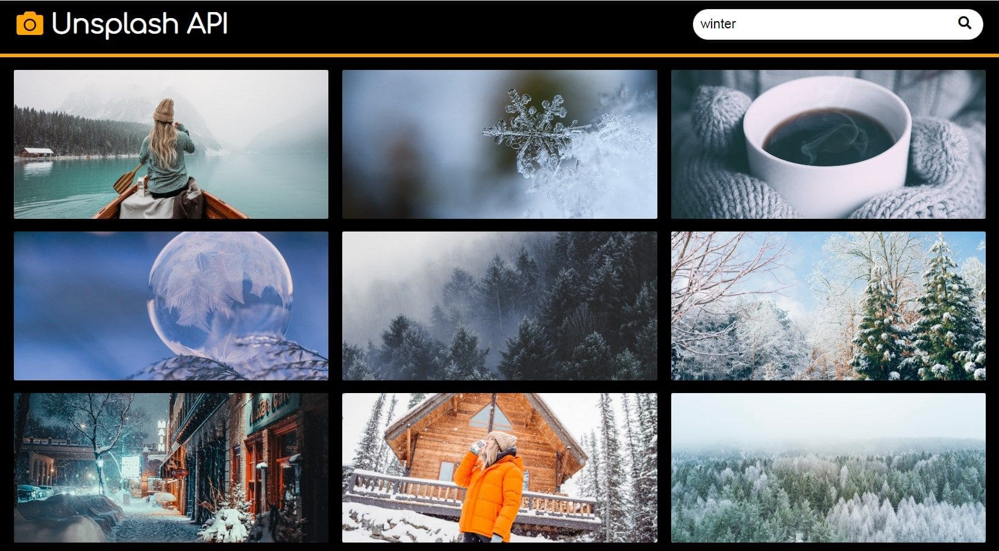
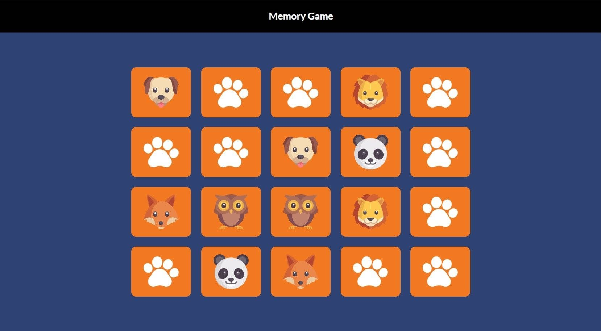

# js30#

js30 - три небольших js-проекта, которые вы выполните на этапе stage#0.  
Выполнение самостоятельных проектов - наиболее эффективный и одновременно невероятно увлекательный способ использовать возможности языка, на практике изучить его особенности.

Задание js30 состоит из трёх частей. В ходе выполнения каждой части задания вам необходимо выполнить один js-проект из трёх проектов на выбор.  
Проекты расположены в порядке увеличения их сложности. Баллы за выполнение каждого из трёх проектов одинаковые, вне зависимости от их уровня сложности.  

Продолжительность выполнения каждой части задания - одна неделя.   
Выдача задания во вторник утром, дедлайн в следующий понедельник поздно ночью в 23:59 UTC (три часа ночи по Минску). Проверяется задание в ходе кросс-чека.  
Кросс-чек стартует во вторник утром и заканчивается в четверг поздно ночью в 23:59 UTC.

## Проекты на выбор
**В каждой части задания необходимо выбрать и выполнить только один проект**

 

## Часть 1. Работа с медиа
Выполняя предложенные проекты вы научитесь использовать JavaScript для работы с аудио- и видео-файлами.

|<h4>[Звуки природы](js30-1.md)</h4>|<h4>[Аудиоплеер](js30-2.md)</h4>|<h4>[Кастомный видеоплеер](js30-3.md)</h4>|
|----------------------|----------------------|----------------------|
||||

 

## Часть 2. Работа с API
Выполняя проекты этой части задания вы научитесь получать данные от API и отображать их на веб-странице.

|<h4>[Генератор цитат](js30-4.md)</h4>|<h4>[Галерея изображений](js30-5.md)</h4>|<h4>[Посковик по видео](js30-6.md)</h4>|
|----------------------|----------------------|----------------------|
||||

 

## Часть 3. Игра
У программистов есть возможность не только играть в чужие игры, но и создавать свои собственные!

|<h4>[Tic Tac Toe](js30-7.md)</h4>|<h4>[Memory Game](js30-8.md)</h4>|<h4>[Игра на выбор](js30-9.md)</h4>|
|----------------------|----------------------|----------------------|
||||

 

## Работа над проектом
- выполнение таска начните с изучения техзадания. Не приступайте к работе над проектом без точного понимания что именно от вас требуется сделать. Полчаса изучения ТЗ могут сэкономить несколько часов кодинга, избавят от необходимости переписывать уже написанный код
- общие для всех проектов требования описаны в этом документе, требования каждого конкретного проекта описываются в документе с проектом, который открывается при клике по ссылке с названием проекта в таблице выше
- для каждого проекта ближе к моменту его выдачи будет предложено демо, которое поможет понять задание, визуализировать его требования. Вы можете в своём проекте повторить дизайн демо, использовать медиафайлы демо: картинки, иконки, звуки и видео. Копировать код демо запрещено. Весь код приложения - html, css, js вам необходимо написать самостоятельно
- для каждого проекта ближе к моменту его выдачи будут подготовленты советы по его выполнению. С советами необходимо ознакомиться, это ускорит работу над проектом, поможет в понимании его требований. Следовать предложенным советам не обязательно
- вы можете обсуждать задание в дискорде, искать решение похожих заданий в интернете, делиться найденными материалами с другими студентами. Единственное, что строго запрещено - копирование (Ctrl + C => Ctrl + V) кода чужих проектов. Весь html, css, js код приложения вам необходимо написать самостоятельно
- при наличии желания и свободного времени вы можете вносить в проекты свои собственные изменения и улучшения, если они не мешают работе указанного в задании функционала.  
- также при наличии желания и свободного времени вы можете в каждой части задания выполнить не один, а два или все три проекта на выбор, но дополнительных баллов за это не предусмотрено.  
После окончания проверки задания все три колонки с проектами в score схлопнутся в одну, и в ней останется только одна лучшая оценка

## Рекомендации по написанию кода
- основное и самое важное требование к коду - его работоспособность: работающий код лучше идеального, но не работающего
- тем не менее, есть те рекомендации, которым необходимо следовать даже начинающему разработчику:
  - правильное наименование переменных и функций
  - используйте prettier для форматирования кода, отформатированный код проще читается
  - избегайте дублирования кода, повторяющиеся фрагменты кода вынесите в функции
  - стремитесь к оптимальному размеру функций, следуйте правилу: одна функция – одна задача
  - избегайте глубокой вложенности циклов, магических чисел
  - используйте фичи ES6 и выше, например, let, const для объявления переменных, стрелочные функции и т.д

## Требования к вёрстке
- внешний вид приложения соответствует предложенному образцу или является его улучшенной версией
- вёрстка адаптивная. Корректность отображения приложения проверяется при ширине страницы от 1920рх до 768рх
- интерактивность элементов, с которыми пользователи могут взаимодействовать, изменение внешнего вида самого элемента и состояния курсора при наведении, использование разных стилей для активного и неактивного состояния элемента, плавные анимации
- в футере приложения есть ссылка на гитхаб автора приложения, год создания приложения, [логотип курса](https://rs.school/images/rs_school_js.svg) со [ссылкой на курс](https://rs.school/js-stage0/)

## Технические требования
- работа приложения проверяется в браузере Google Chrome последней версии
- можно использовать [bootstrap](https://getbootstrap.com/), [material design](https://material.io/), css-фреймворки, html и css препроцессоры
- не разрешается использовать jQuery, другие js-библиотеки и фреймворки
- js-код приложения должен быть читаемым, без минимизации или обфускации

## Требования к репозиторию
- задание выполняется в приватном репозитории школы. [Как работать с приватным репозиторием школы](https://docs.rs.school/#/private-repository)
- если у вас не создаётся приватный репозиторий школы, задание можно выполнять в личном приватном репозитории
- от ветки `main` создайте ветку с названием проекта в ней создайте папку с названием проекта, в ней разместите файлы проекта
- для деплоя используйте `gh-pages` [Как сделать деплой задания из приватного репозитория школы](https://docs.rs.school/#/private-repository?id=Как-сделать-деплой-задания-из-приватного-репозитория-школы)
- если не можете для деплоя использовать `gh-pages`, используйте https://app.netlify.com/drop. Название страницы дайте по схеме: имя гитхаб аккаунта - название таска

## Требования к коммитам
- История коммитов должна отображать процесс разработки приложения.
- [Названия коммитов дайте согласно гайдлайну](https://docs.rs.school/#/git-convention)

## Требования к Pull Request
- Название Pull Request дайте по названию задания
- [Описание Pull Request дайте по схеме](https://docs.rs.school/#/pull-request-review-process?id=Требования-к-pull-request-pr)  
**Мержить Pull Request из ветки разработки в ветку `main` не нужно**.

## Чтобы получить баллы за задание необходимо: 
- Выполнить задание
- Засабмитить задание т.е. отправить его на проверку \*  
- Проверить все присланные на проверку работы и засабмитить результаты проверки до дедлайна кросс-чека \**  
\* *Засабмитить задание можно только до дедлайна таска, после дедлайна сабмит недоступен*  
\** *Сабмит результатов кросс-чек проверки доступен и после дедлайна кросс-чека, но на оценки проверяющего  и проверяемых не влияет*

## Как сабмитить задание
После выдачи таска, но до наступления дедлайна зайдите в rs app https://app.rs.school/, выберите **Cross-Check: Submit**, в выпадающем списке выберите свой проект, в поле **Solution URL** добавьте ссылку на задеплоенную версию своего приложения, нажмите кнопку **Submit**.

**Будьте очень внимательны при сабмите!**. Убедитесь, что из трёх проектов на выбор, при сабмите вы выбрали свой.  

## Рекомендации по сабмиту
- Засабмитить задание рекомендуется как можно раньше, как только в rs app появится такая возможность. После сабмита задание можно продолжать выполнять до самого дедлайна
- Так как проект выполняется в приватном репозитории, сабмитить ссылку на репозиторий или pull request нет смысла - проверяющий его не увидит. Приватный репозиторий школы видите только вы сами, админы курса, и увидят ваши менторы, когда они появятся 
- Убедитесь, что задеплоенная вами ссылка открывается в режиме инкогнито браузера
- Сделайте скриншот засабмиченной ссылки и сохраняйте его у себя до старта кросс-чека. Если вам не придут работы на проверку, скриншот послужит доказательством, что вы вовремя засабмитили ссылку на работу. В таком случае вашу работу проверят в ходе апелляции

## Проверка задания
- форма проверки каждой части задания - кросс-чек
- инструкция по проведению cross-check: https://docs.rs.school/#/cross-check-flow