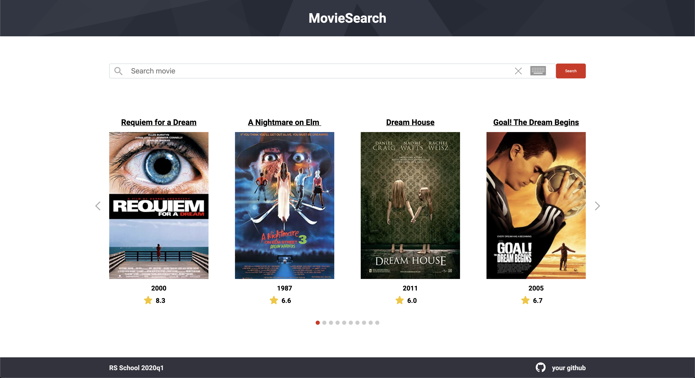

# MovieSearch

| Deadline         | Repository name| Branch name |
| ---------------- | ----------- | ----------- |
| 26.04.2020 23:59 | movie-search    | develop    |


**MovieSearch** - одностраничное приложение, отображающее информацию о фильмах по введённым в строку поиска словам.  
Для получения информации используется OMDb RESTful API.

## Структура приложения 
- поле поиска
- карточки с информацией о фильмах

## Макет приложения:




## Работа приложения

- когда пользователь открывает приложение, на странице отображается поле поиска и карточки с информацией о фильмах по произвольному, указанному разработчиком запросу
- максимальное количество карточек на странице - четыре. С уменьшением ширины страницы количество карточек уменьшается
- на каждой карточке отображается следующия информация о фильме: название, постер, дата выхода, рейтинг IMDb. 
- карточки можно перелистывать, для этого используется слайдер/свайпер (для его добавления может использоваться библиотека)
- если пользователь вводит корректный поисковый запрос, информация на карточках с фильмами обновляется
- если пользователь вводит некорректный поисковый запрос, приложение не ломается, выводится уведомление об ошибке

## Требования к репозиторию

- для разработки приложения используйте собственный приватный репозиторий
- название репозитория: **movie-search**, название ветки, в которой ведётся разработка - **develop**, ветка **master** пустая, содержит только README.md
- история коммитов должна отображать процесс разработки приложения. [Требования к коммитам](https://docs.rs.school/#/git-convention)
- демо-версия приложения размещается на `https://www.netlify.com/`, либо на другом подобном хостинге
- после окончания разработки или при наступлении дедлайна, создайте pull request из ветки develop в ветку master. [Требования к pull request](https://docs.rs.school/#/stage2?id=Описание-pull-request-должно-содержать-следующую-информацию). Мержить pull request не нужно
- код приложения, коммиты, pull request не проверяются и не оценивается
- приложение проверятся только в ходе кросс-чека
- для проверки ссылку на демо-версию приложения необходимо будет добавить в rss-app

## Технические требования
- работа приложения проверяется в браузере Google Chrome последней версии
- использование jQuery не допускается
- нельзя использовать Angular/React/Vue 
- можно использовать bootstrap, css фреймворки, html и css препроцессоры
    
## Критерии оценки:
**Максимальный балл за задание: 100 баллов при кросс-чеке / проверка ментором не предусмотрена**   

### Basic scope +20  
- [ ] вёрстка, дизайн, UI. Минимальная ширина, при которой приложение отображается корректно – 320 рх  +10
- [ ] при вводе в поле поиска корректного поискового запроса обновляются данные о фильмах +10

### Advanced scope +60
- [ ] поиск +10
  - [ ] при открытии приложения курсор находится в строке поиска
  - [ ] автозаполнение поля ввода отключено (нет выпадающего списка с предыдущими запросами)
  - [ ] есть placeholder 
  - [ ] поисковый запрос можно ввести как нажатием клавиши Enter, так и кликом по кнопке Search или аналогичной
  - [ ] после ввода поискового запроса и отображения результатов поиска, набранный запрос отображается в поле поиска 
- [ ] при вводе некорректного запроса приложение не ломается, выводится уведомление "No results were found for … " +10
- [ ] при вводе запроса на русском языке поисковый запрос переводится на английский язык, выводится уведомление "Showing results for … " +20
- [ ] на карточке с фильмом указывается рейтинг IMDb +10
- [ ] бесконечный адаптивный слайдер +10

### Hacker scope +20
- [ ] поисковый запрос можно вводить с виртуальной клавиатуры +20


## Штрафные баллы
- [ ] ошибки в работе приложения -10 

## Cross-check
- инструкция по проведению cross-check: https://docs.rs.school/#/cross-check-flow
- форма для проверки задания: https://cross-check-movie-search.netlify.com/

## Ключевые навыки

- использование RESTful API
- работа с асинхронными запросами
- реализация поиска

## Материалы
- [OMDb API](http://www.omdbapi.com/)
- [Yandex.Translate API](https://tech.yandex.com/translate/)
- [How to build a movie search app](https://www.freecodecamp.org/news/how-to-build-a-movie-search-app-using-react-hooks-24eb72ddfaf7/)

## Примеры использования API
- Получаем OMDb API Key    
`http://www.omdbapi.com/apikey.aspx`
- Поисковый запрос по ключевому слову "dream"  
`https://www.omdbapi.com/?s=dream&apikey=9b67fc54`
- Получаем рейтинг IMDb по imdbID из предыдущего запроса  
`https://www.omdbapi.com/?i=tt0180093&apikey=9b67fc54`
- Получаем Yandex.Translate API key  
`https://translate.yandex.com/developers/keys`
- Перевод слова "мечта"  
`https://translate.yandex.net/api/v1.5/tr.json/translate?key=trnsl.1.1.20200322T155651Z.de98a60e6a99185e.089aea4237b51c6db082c966f27a7895cd1e8b44&text=мечта&lang=ru-en`

<details> 
  <summary>Примеры асинхронных запросов</summary>
  
  <p></p>
  
  JS-код для получения названия фильма (название выводится в консоль)
  
  - при помощи fetch
  
 ``` javascript 
  function getLinkToImage() {
  const url = 'https://www.omdbapi.com/?s=dream&apikey=9b67fc54';
  fetch(url)
    .then(res => res.json())
    .then(data => {
      console.log(data.Search[0].Title)
    });
  }
``` 
  - при помощи async/await
  
 ``` javascript 
  async function getLinkToImage() {
    const url = 'https://www.omdbapi.com/?s=dream&apikey=9b67fc54';
    const res = await fetch(url);
    const data = await res.json();
    console.log(data.Search[0].Title);
  }
``` 

</details> 

### Документ для вопросов
- документ для вопросов, связанных с выполнением задания: https://docs.google.com/spreadsheets/d/1QQ4dz0sTOB-DePFiIXL8ZXoUWsZvWW3uvwnkqpUigk4/edit#gid=0